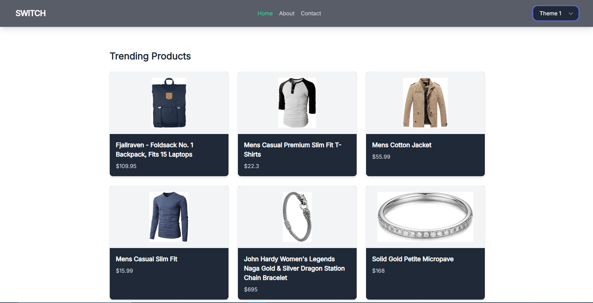
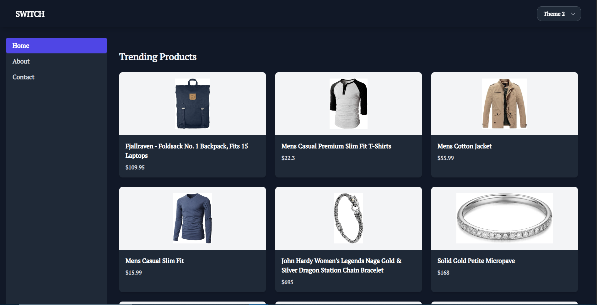
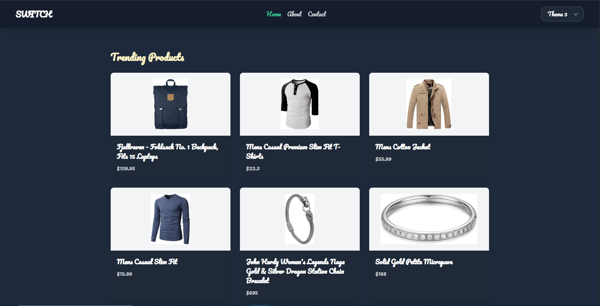

# 🎨 Multi-Theme Switcher App

A modern, mobile-first React + TypeScript application with three distinct visual themes.  
Built using **Redux Toolkit**, **Tailwind CSS**, and **React Router DOM**.  
It displays live product data and allows users to switch themes with different layouts, fonts, and colors.

---

## 🌟 Features

- 🎨 **3 Complete Themes**
  - **Theme 1**: Minimalist light layout with Inter (sans-serif)
  - **Theme 2**: Dark mode + sidebar layout + bold serif font
  - **Theme 3**: Colorful card grid layout with Pacifico font (playful)

- 🛠 **Redux Toolkit** for global theme state management
- 🖼 **Live product listing** from [FakeStore API](https://fakestoreapi.com/)
- 📱 **Mobile-first responsive design**
- 💾 Theme is persisted using **localStorage**
- 🎯 Dynamic UI: each theme uses different layout, font, and structure
- 🧭 Built with **React Router DOM** (`/`, `/about`, `/contact`)
- 🧩 Reusable components and clean architecture
- 🎈 Smooth transitions and hover effects
- ✅ Fully compliant with PDF assessment requirements

---

## Live Application URL

The Application is deployed in 
[live url](https://theme-switcher-app-blue.vercel.app/)

Click on the link to see the application

## 🖼️ Screenshots

### Theme 1 (Minimalist)


### Theme 2 (Dark + Sidebar)


### Theme 3 (Colorful Cards)



---

## 🔧 Tech Stack

| Tech             | Purpose                          |
|------------------|----------------------------------|
| React            | UI Framework                     |
| TypeScript       | Type Safety                      |
| Vite             | Fast dev + build tool            |
| Tailwind CSS     | Utility-first CSS styling        |
| Redux Toolkit    | Theme state management           |
| React Router DOM | Routing (Home, About, Contact)   |
| Lucide-react     | Clean icon set                   |
| Fakestore API    | Dummy product data               |

---

## 📁 Folder Structure

<details>
<summary>Click to view</summary>

```bash
src/
├── assets/          # Static images/icons (if needed)
├── components/      # Reusable UI components (Card, Header, etc.)
├── features/
│   └── theme/       # Redux slice for theme
├── layouts/         # Layouts: MainLayout, SidebarLayout
├── pages/           # Home, About, Contact
├── redux/           # Redux store config
├── App.tsx          # App router + layout logic
├── main.tsx         # Entry point
└── index.css        # Tailwind and font imports
```

### 1. Clone the Repo

```bash
git clone https://github.com/Amish8863/theme-switcher-app.git
cd theme-switcher-app
```

Install all the npm packages. Go into the project folder and type the following command to install all npm packages

```bash
npm install
```

In order to run the application Type the following command

```bash
npm run dev
```

Now open your browser and go to:
```bash
http://localhost:51733
```
You'll see the app running locally

## Author
### Amish Singh
[GitHub Profile](https://github.com/Amish8863)

The Application Runs on **localhost:5173**